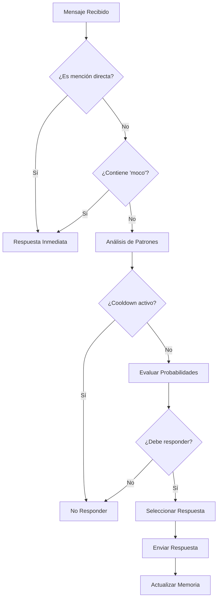

<div align="center">

# 🤖 Dr. Salitas Bot - El Perrito con Terno más Bizarro

Un bot de Discord avanzado basado en el universo del Dr. Pene, con personalidad única, sistema de memoria contextual, detección de patrones y múltiples mejoras de rendimiento.

## 🚀 Características Principales

### 🧠 Sistema de Personalidad Avanzada
- **Personalidad única**: Dr. Salitas, el perrito con terno más bizarro del universo
- **Respuestas contextuales**: Adapta sus respuestas según el contexto y el historial
- **Sistema de humor**: Respuestas variadas con diferentes niveles de bizarrez

### 💾 Sistema de Base de Datos SQLite
- **Persistencia de datos**: Almacena mensajes, comandos y estadísticas
- **Seguimiento de usuarios**: Historial completo de interacciones
- **Métricas de rendimiento**: Estadísticas detalladas del bot

### ⚡ Sistema de Cache Avanzado
- **Cache multinivel**: Diferentes tipos de cache con TTL personalizados
- **Optimización de rendimiento**: Respuestas más rápidas para comandos frecuentes
- **Gestión automática**: Limpieza automática y estadísticas en tiempo real

### 🛡️ Sistema de Validación Robusto
- **Validación con Joi**: Esquemas de validación para todos los tipos de datos
- **Sanitización de contenido**: Prevención de ataques XSS y contenido malicioso
- **Rate limiting**: Protección contra spam y abuso
- **Detección de patrones peligrosos**: Identificación automática de contenido sospechoso

### 🎯 Comandos Slash Disponibles

#### Comandos Básicos
- `/ping` - Respuesta única del Dr. Salitas
- `/chiste` - Chistes bizarros del universo Dr. Pene
- `/frase` - Frases típicas del universo
- `/personalidad` - Información sobre Dr. Salitas

#### Comandos de Información
- `/memoria` - Estadísticas de memoria del bot
- `/lore` - Información detallada de personajes
- `/patrones` - Estadísticas del sistema de detección

#### Comandos Interactivos
- `/batalla` - Genera batallas épicas entre personajes
- `/cosmic` - Frases cósmicas aleatorias
- `/mood` - Estado de ánimo actual del Dr. Salitas

### 🔍 Sistema de Detección de Patrones
- **Análisis de comportamiento**: Detecta patrones en las conversaciones
- **Respuestas adaptativas**: Ajusta las respuestas según los patrones detectados
- **Estadísticas detalladas**: Métricas sobre patrones identificados

### 📅 Sistema de Mensajes Programados
- **Mensajes matutinos**: Saludos únicos cada mañana
- **Mensajes nocturnos**: Despedidas cósmicas los fines de semana
- **Eventos especiales**: Mensajes para ocasiones específicas

## 🛠️ Instalación y Configuración

### Prerrequisitos
- Node.js 16.0.0 o superior
- npm o yarn
- Token de bot de Discord

### Instalación
```bash
# Clonar el repositorio
git clone <repository-url>
cd dr-salitas-bot

# Instalar dependencias
npm install

# Configurar variables de entorno
cp .env.example .env
# Editar .env con tu token de Discord
```

### Variables de Entorno
```env
DISCORD_TOKEN=tu_token_de_discord_aqui
GENERAL_CHANNEL_ID=id_del_canal_general
```

### Ejecución
```bash
# Modo desarrollo
npm start

# Ejecutar pruebas
node test-commands.js
```

## 📦 Dependencias Principales

- **discord.js**: Framework para bots de Discord
- **sqlite3**: Base de datos SQLite
- **node-cache**: Sistema de cache en memoria
- **joi**: Validación de esquemas
- **node-cron**: Programación de tareas
- **winston**: Sistema de logging avanzado

## 🏗️ Arquitectura del Proyecto

```
dr-salitas-bot/
├── data/                    # Datos del bot
│   ├── character-lore.js   # Información de personajes
│   └── dr-salitas.db       # Base de datos SQLite
├── database/               # Sistema de base de datos
│   └── database.js         # Clase Database
├── memory/                 # Sistema de memoria
│   └── contextual-memory.js
├── mood/                   # Sistema de humor
│   └── mood-system.js
├── patterns/               # Detección de patrones
│   ├── pattern-detection.js
│   └── pattern-responses.js
├── personality/            # Sistema de personalidad
│   └── drpene-personality.js
├── utils/                  # Utilidades
│   ├── cache.js           # Sistema de cache
│   ├── logger.js          # Sistema de logging
│   └── validation.js      # Sistema de validación
├── index.js               # Archivo principal
├── test-commands.js       # Script de pruebas
└── package.json
```

## 🔧 Sistemas Implementados

### 1. Base de Datos SQLite
- **Tablas**: users, guilds, messages, commands, bot_stats
- **Índices optimizados**: Para consultas rápidas
- **Logging automático**: Todos los mensajes y comandos

### 2. Sistema de Cache
- **Cache principal**: TTL 10 minutos
- **Cache de usuarios**: TTL 30 minutos
- **Cache de comandos**: TTL 5 minutos
- **Cache de patrones**: TTL 1 hora
- **Cache de estadísticas**: TTL 15 minutos

### 3. Sistema de Validación
- **Validación de mensajes**: Contenido, formato y seguridad
- **Validación de comandos**: Parámetros y permisos
- **Rate limiting**: 10 mensajes por minuto por usuario
- **Sanitización**: Limpieza automática de contenido

### 4. Sistema de Limpieza Automática
- **Patrones**: Cada 6 horas
- **Rate limits**: Cada 2 horas
- **Cache**: Automático según TTL

## 📊 Métricas y Monitoreo

El bot incluye sistemas completos de logging y métricas:

- **Logs estructurados**: Con niveles de severidad
- **Métricas de rendimiento**: Tiempo de respuesta y uso de recursos
- **Estadísticas de uso**: Comandos más utilizados y patrones detectados
- **Monitoreo de errores**: Captura y logging de excepciones

## 🧪 Pruebas

El proyecto incluye un sistema de pruebas automatizado:

```bash
node test-commands.js
```

Las pruebas verifican:
- ✅ Conexión a la base de datos
- ✅ Funcionamiento del sistema de cache
- ✅ Validación de mensajes y comandos
- ✅ Detección de contenido peligroso
- ✅ Rate limiting

## 🚀 Próximas Mejoras

- [ ] Sistema de métricas con Prometheus
- [ ] Comandos slash avanzados (/configurar, /estadisticas, /admin)
- [ ] Sistema de respaldo automático
- [ ] API REST para administración web
- [ ] Dashboard web para monitoreo
- [ ] Integración con webhooks

## 🤝 Contribución

1. Fork el proyecto
2. Crea una rama para tu feature (`git checkout -b feature/AmazingFeature`)
3. Commit tus cambios (`git commit -m 'Add some AmazingFeature'`)
4. Push a la rama (`git push origin feature/AmazingFeature`)
5. Abre un Pull Request

## 📝 Licencia

Este proyecto está bajo la Licencia MIT. Ver el archivo `LICENSE` para más detalles.

## 🎭 Créditos

Basado en el universo creativo del Dr. Pene, con Dr. Salitas como el perrito con terno más bizarro y elegante del cosmos.

---

**¡Dr. Salitas está listo para hacer que tu servidor de Discord sea más bizarro y divertido! 🐕‍🦺✨**

---

</div>

## 📋 Tabla de Contenidos

- [🌟 Características Principales](#-características-principales)
- [🎭 Personalidad](#-personalidad)
- [🚀 Inicio Rápido](#-inicio-rápido)
- [⚙️ Instalación Detallada](#️-instalación-detallada)
- [🔧 Configuración](#-configuración)
- [📖 Comandos Disponibles](#-comandos-disponibles)
- [🧠 Sistema de IA](#-sistema-de-ia)
- [🌐 Despliegue](#-despliegue)
- [🛠️ Desarrollo](#️-desarrollo)
- [📊 Arquitectura](#-arquitectura)
- [🤝 Contribuir](#-contribuir)
- [📄 Licencia](#-licencia)

## 🌟 Características Principales

### 🧠 **Inteligencia Artificial Avanzada**
- **Sistema de Patrones**: Detecta comportamientos y responde contextualmente
- **Memoria Conversacional**: Recuerda interacciones previas con usuarios
- **Análisis de Sentimientos**: Adapta respuestas según el estado emocional
- **Anti-Spam Inteligente**: Previene respuestas repetitivas con cooldowns dinámicos

### 🎮 **Funcionalidades Interactivas**
- **Comandos Slash**: Interface moderna y fácil de usar
- **Batallas Épicas**: Sistema de combates entre personajes del universo
- **Respuestas Contextuales**: Más de 200+ respuestas únicas
- **Estados de Ánimo**: El bot cambia su personalidad según el contexto

### 🔒 **Seguridad y Rendimiento**
- **Rate Limiting**: Protección contra spam y abuso
- **Manejo de Errores**: Sistema robusto de recuperación
- **Logging Avanzado**: Monitoreo completo de actividades
- **Escalabilidad**: Optimizado para servidores grandes

## 🎭 Personalidad

> *"¡Wena po, soy el Dr. Salitas! Un perrito con terno que sabe más que tu profe de matemáticas."*

**Dr. Salitas** es un personaje único del universo **Dr. Pene** con características distintivas:

- 🐕 **Especie**: Perrito antropomórfico con terno elegante
- 🇨🇱 **Origen**: Habla como chileno auténtico con modismos locales
- 🎓 **Personalidad**: Intelectual, sarcástico, pero entrañable
- 💬 **Estilo**: Humor bizarro y frases memorables
- 🧠 **Habilidades**: Conocimiento enciclopédico con toques de locura

### Frases Características:
- *"¡Eso está más claro que agua de bidé!"*
- *"¡Wena po, cabros!"*
- *"¡Más perdido que turista en feria!"*

## 🚀 Inicio Rápido

### Prerrequisitos
- Node.js 18+ instalado
- Token de bot de Discord
- Cuenta en GitHub (para despliegue)

### Instalación Express (5 minutos)

```bash
# 1. Clonar el repositorio
git clone https://github.com/AndreeRolack71/dr-salitas-bot.git
cd dr-salitas-bot

# 2. Instalar dependencias
npm install

# 3. Configurar variables de entorno
cp .env.example .env
# Editar .env con tu DISCORD_TOKEN

# 4. Ejecutar el bot
npm start
```

## ⚙️ Instalación Detallada

### 1. **Preparación del Entorno**

```bash
# Verificar versión de Node.js
node --version  # Debe ser 18+

# Clonar repositorio
git clone https://github.com/AndreeRolack71/dr-salitas-bot.git
cd dr-salitas-bot
```

### 2. **Instalación de Dependencias**

```bash
# Instalar paquetes principales
npm install

# Verificar instalación
npm list --depth=0
```

### 3. **Configuración del Bot de Discord**

1. Ve a [Discord Developer Portal](https://discord.com/developers/applications)
2. Crea una nueva aplicación
3. Ve a la sección "Bot"
4. Copia el token del bot
5. Invita el bot a tu servidor con permisos necesarios

## 🔧 Configuración

### Variables de Entorno

Crea un archivo `.env` en la raíz del proyecto:

```env
# 🔑 CONFIGURACIÓN PRINCIPAL
DISCORD_TOKEN=tu_token_de_discord_aqui
NODE_ENV=production

# 🤖 CONFIGURACIÓN DE IA (Opcional)
OPENAI_API_KEY=tu_api_key_de_openai

# 📊 CONFIGURACIÓN DE LOGGING
LOG_LEVEL=info
LOG_TO_FILE=true

# ⚡ CONFIGURACIÓN DE RENDIMIENTO
MAX_MEMORY_USERS=1000
CLEANUP_INTERVAL=3600000
RESPONSE_TIMEOUT=5000
```

### Configuración Avanzada

#### `config/bot-config.js`
```javascript
module.exports = {
    // Cooldowns en milisegundos
    cooldowns: {
        general: 30000,      // 30 segundos
        triggered: 5000,     // 5 segundos para usuarios "triggeados"
        mention: 0           // Sin cooldown para menciones directas
    },
    
    // Probabilidades de respuesta
    probabilities: {
        chain: 0.3,          // 30% para cadenas de mensajes
        highIntensity: 0.7,  // 70% para alta intensidad
        random: 0.1          // 10% respuestas aleatorias
    }
};
```

## 📖 Comandos Disponibles

### Comandos Slash

| Comando | Descripción | Uso | Ejemplo |
|---------|-------------|-----|---------|
| `/saludo` | Saluda de manera personalizada | `/saludo [usuario]` | `/saludo @usuario` |
| `/batalla` | Inicia una batalla épica | `/batalla [oponente]` | `/batalla Dr. Pene` |
| `/estado` | Muestra el estado del bot | `/estado` | - |
| `/ayuda` | Información de comandos | `/ayuda` | - |
| `/personalidad` | Cambia el modo del bot | `/personalidad [modo]` | `/personalidad serio` |

### Comandos de Texto

| Trigger | Respuesta | Ejemplo |
|---------|-----------|---------|
| `moco` | Respuesta especial instantánea | "Hay moco en el chat" |
| `@Dr. Salitas` | Respuesta directa sin cooldown | "@Dr. Salitas ¿cómo estás?" |
| Patrones de cadena | Respuestas contextuales | Mensajes consecutivos similares |

## 🧠 Sistema de IA

### Arquitectura de Patrones

```
📁 patterns/
├── pattern-detection.js    # Motor de detección
├── pattern-responses.js    # Base de respuestas
└── contextual-memory.js    # Sistema de memoria
```

#### Detección de Patrones
- **Usuarios Triggeados**: Detecta comportamientos repetitivos
- **Cadenas de Mensajes**: Identifica conversaciones en cadena
- **Análisis de Intensidad**: Mide la "intensidad" de las conversaciones
- **Memoria Contextual**: Recuerda interacciones previas

#### Sistema de Respuestas
- **200+ Respuestas Únicas**: Variedad garantizada
- **Respuestas Contextuales**: Basadas en el historial
- **Anti-Repetición**: Evita respuestas duplicadas
- **Escalado de Intensidad**: Respuestas más frecuentes en conversaciones activas

## 🌐 Despliegue

### ✅ Render (Recomendado - Gratuito)

**Dr. Salitas está actualmente desplegado y funcionando 24/7 en Render.**

#### Configuración Exitosa:
1. **Tipo de Servicio**: Background Worker (correcto para bots de Discord)
2. **Auto-Deploy**: Habilitado desde GitHub
3. **Variables de Entorno**: Configuradas correctamente
4. **Estado**: ✅ **FUNCIONANDO**

#### Pasos para replicar:
```bash
# 1. Crear Background Worker en Render
# 2. Conectar repositorio GitHub
# 3. Configurar variables de entorno:
DISCORD_TOKEN=tu_token_aqui
CLIENT_ID=tu_client_id
NODE_ENV=production

# 4. Configuración del servicio:
Build Command: npm install
Start Command: node index.js
```

#### Ventajas de Render:
- ✅ **Completamente gratuito**
- ✅ **750 horas/mes** (suficiente para 24/7)
- ✅ **Auto-deploy** desde GitHub
- ✅ **SSL incluido**
- ✅ **Logs en tiempo real**
- ⚠️ Se "duerme" tras 15 min de inactividad (se despierta automáticamente)

### Alternativas de Despliegue

<details>
<summary><strong>Railway</strong></summary>

⚠️ **Nota**: Railway ahora requiere pago mínimo de $5 USD/mes.

1. **Conectar Repositorio**
   ```bash
   # El repositorio ya está listo para Railway
   # Solo necesitas conectarlo en railway.app
   ```

2. **Variables de Entorno en Railway**
   ```
   DISCORD_TOKEN=tu_token
   NODE_ENV=production
   ```

3. **Despliegue Automático**
   - Railway detecta el `Procfile` automáticamente
   - Despliegue en menos de 2 minutos
   - SSL y dominio incluidos

</details>

### 🌐 Otras Plataformas

<details>
<summary><strong>Render</strong></summary>

```yaml
# render.yaml
services:
  - type: web
    name: dr-salitas-bot
    env: node
    buildCommand: npm install
    startCommand: npm start
    envVars:
      - key: DISCORD_TOKEN
        sync: false
```
</details>

<details>
<summary><strong>Heroku</strong></summary>

```bash
# Heroku CLI
heroku create dr-salitas-bot
heroku config:set DISCORD_TOKEN=tu_token
git push heroku main
```
</details>

<details>
<summary><strong>Fly.io</strong></summary>

```toml
# fly.toml
app = "dr-salitas-bot"

[build]
  builder = "heroku/buildpacks:20"

[[services]]
  http_checks = []
  internal_port = 8080
  processes = ["app"]
  protocol = "tcp"
```
</details>

## 🛠️ Desarrollo

### Estructura del Proyecto

```
dr-salitas-bot/
├── 📁 data/                    # Datos del bot
│   ├── character-lore.js       # Historia del personaje
│   └── personality.json        # Configuración de personalidad
├── 📁 memory/                  # Sistema de memoria
│   └── contextual-memory.js    # Memoria conversacional
├── 📁 mood/                    # Sistema de estados de ánimo
│   └── mood-system.js          # Lógica de emociones
├── 📁 patterns/                # Sistema de patrones de IA
│   ├── pattern-detection.js    # Detección de patrones
│   └── pattern-responses.js    # Respuestas contextuales
├── 📁 personality/             # Personalidad del bot
│   └── drpene-personality.js   # Personalidad Dr. Pene
├── 📁 scripts/                 # Herramientas de desarrollo
│   └── chat-analyzer.js        # Analizador de conversaciones
├── 📄 index.js                 # Archivo principal
├── 📄 package.json             # Dependencias
├── 📄 Procfile                 # Configuración de despliegue
└── 📄 README.md               # Este archivo
```

### Scripts de Desarrollo

```bash
# Desarrollo con auto-reload
npm run dev

# Análisis de patrones
npm run analyze

# Linting y formato
npm run lint
npm run format

# Tests
npm test
```

### Contribuir al Desarrollo

1. **Fork** el repositorio
2. **Crea** una rama para tu feature (`git checkout -b feature/nueva-funcionalidad`)
3. **Commit** tus cambios (`git commit -m 'Agregar nueva funcionalidad'`)
4. **Push** a la rama (`git push origin feature/nueva-funcionalidad`)
5. **Abre** un Pull Request

## 📊 Arquitectura

### Flujo de Procesamiento de Mensajes



### Componentes Principales

- **🎯 Event Handler**: Procesa eventos de Discord
- **🧠 Pattern Engine**: Analiza y detecta patrones
- **💾 Memory System**: Gestiona memoria conversacional

## 📊 Estado del Bot

### 🟢 Estado Actual: ACTIVO
- **Plataforma**: Render (Background Worker)
- **Uptime**: 24/7 (con hibernación automática)
- **Última actualización**: Enero 2025
- **Versión**: 1.0.0

### ✅ Funcionalidades Verificadas
- ✅ Comandos slash (`/ping`, `/frase`, `/chiste`)
- ✅ Respuestas automáticas a menciones
- ✅ Sistema de estados de ánimo
- ✅ Detección de patrones
- ✅ Memoria contextual
- ✅ Auto-deploy desde GitHub

### 🔧 Correcciones Recientes
- **Enero 2025**: Corregidos errores críticos en `drpene-personality.js`
  - Validación de propiedades undefined
  - Manejo robusto del sistema de estados de ánimo
  - Validación de entrada en métodos críticos
  - Fallbacks para respuestas por defecto

---

<div align="center">
  <strong>🎉 Dr. Salitas está listo para hacer reír a tu servidor de Discord 🎉</strong>
</div>

## 🤝 Contribuir

### Reportar Bugs

Usa el [sistema de issues](https://github.com/AndreeRolack71/dr-salitas-bot/issues) con:
- Descripción detallada del problema
- Pasos para reproducir
- Logs relevantes
- Información del entorno

### Sugerir Mejoras

- Abre un issue con la etiqueta `enhancement`
- Describe la funcionalidad propuesta
- Explica el caso de uso
- Proporciona ejemplos si es posible

### Código de Conducta

Este proyecto sigue el [Contributor Covenant](https://www.contributor-covenant.org/). Se espera que todos los participantes respeten estas pautas.

## 📄 Licencia

Este proyecto está bajo la Licencia MIT. Ver el archivo [LICENSE](LICENSE) para más detalles.

---

<div align="center">

### 🌟 ¡Dale una estrella si te gusta el proyecto! ⭐

**Hecho con ❤️ por [AndreeRolack71](https://github.com/AndreeRolack71)**

*Dr. Salitas Bot - Donde la IA se encuentra con el humor chileno* 🇨🇱🤖

</div>